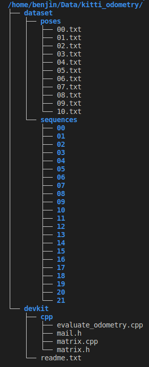

# Datasets
## Kitti Odometry
The Kitti odometry dataset is meant for evaluating visual/lidar odometry systems using the Kitti odometry/SLAM benchmark. 
### Dataset Organization

The *devkit* folder contains a *readme.txt that describes* the properties of the dataset and how to use the evaluation code.

The *dataset* folder contains the data consisting of 41k frames. The *poses* folder contains the ground truth trajectories of the first 11 sequences for training and tuning SLAM algorithms. The remaining 11 sequences are meant for evaluation only. Each sequence contains a *calib.txt, a*nd a *times.txt* containing extrinsic and intrinsic calibration parameters relating the 4 image planes, camera frames, and lidar frame. Each sequence additionally contains gray-scale images in the *image_0,* and image_1 folders, RGB images in the image_2 and image_3 folders, and point clouds in the *velodyne* folder. The images are taken at the same time by a trigger sent by the velodyne. The images are undistorted and subsequently planar rectified. The point clouds are motion-compensated. The format of the data is well documented in the *readme.txt*. More details regarding sensors and preprocessing can be found in the accompanying dataset paper https://www.cvlibs.net/publications/Geiger2012CVPR.pdf.

### C2L Calibration Quality
The below quotes a paragraph from the kitti dataset paper.
> 
Velodyne-to-Camera calibration. Registering the laser
scanner with the cameras is non-trivial as correspondences
are hard to establish due to the large amount of noise in the
reflectance values. Therefore we rely on a semi-automatic
technique: First, we register both sensors using the fully au-
tomatic method of [19]. Next, we minimize the number of
disparity outliers with respect to the top performing meth-
ods in our benchmark jointly with the reprojection errors of
a few manually selected correspondences between the laser
point cloud and the images. As correspondences, we se-
lect edges which can be easily located by humans in both
domains (i.e., images and point clouds). Optimization is
carried out by drawing samples using Metropolis-Hastings
and selecting the solution with the lowest energy.
> 

The method presented in [19] (https://www.cvlibs.net/publications/Geiger2012ICRA.pdf) for lidar-to-camera calibration is highly inaccurate as can be seen from the presented evaluation. The calibration steps after obtaining the initial guess through [19] are not clear to me. 

- What disparity outliers?
- Which top-performing methods from what benchmark?
- How is Metropolis-Hastings used?
- How is the energy defined?

Given the obscurity of the C2L calibration method and a missing evaluation, it is impossible to judge the calibration quality based on the papers.